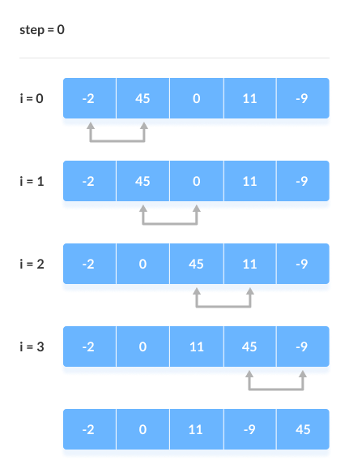

## Уровень 1
1. Как оценивается эффективность алгоритма?
2. Что учитывается при асимптотическом анализе? 
3. Перечислите основные правила асимптотического анализа
4. Какие порядки роста асимтотических функций знаете?
5. Оцените сложность по времени и памяти
```java
void method(int n) {
        for (int i = 0; i < n / 2; i++) {
            for (int j = 1; j + n / 2 <= n; j++) {
                for (int k = 1; k <= n; k = k * 2) {
                    System.out.println("I am expert!");
                }
            }
        }
    }
```
6. Оцените сложность по времени и памяти
```java
void method2(int n) {
        for (int i = 1; i <= n; i++) {
            for (int j = 1; j <= n; j = j + i) {
                System.out.println("I am expert!");
            }
        }
    }
```
7. Оцените сложность по времени и памяти
```java
void method3(int a, int b) { // примечание a > 0 и b > 0
        while (a != b) {
            if (a > b) {
                a = a - b;
            } else {
                b = b - a;
            }
        }
    }
```
## Уровень 2
1. Оцените асимптотическую сложность по времени и памяти для следующего кода, сделайте оценку в лучшем и худшем случае
```java
    public static void fork(int n) {
		if (n < 5) {
			System.out.println("number < 5");
		} else {
			for (int i = 0; i < n; i++) {
				System.out.println(i + " ");
			}
		}
	}
```
2. Реализуйте алгоритм сортировки пузырьком. 

    Алгоритм состоит из повторяющихся проходов по сортируемому массиву. За каждый проход элементы последовательно сравниваются попарно и, если порядок в паре неверный, выполняется перестановка элементов. Проходы по массиву повторяются
   N-1 раз или до тех пор, пока на очередном проходе не окажется, что обмены больше не нужны, что означает — массив отсортирован. При каждом проходе алгоритма по внутреннему циклу очередной наибольший элемент массива ставится на своё место в конце массива рядом с предыдущим «наибольшим элементом», а наименьший элемент перемещается на одну позицию к началу массива («всплывает» до нужной позиции, как пузырёк в воде — отсюда и название алгоритма).

[пример работы](https://ru.wikipedia.org/wiki/%D0%A1%D0%BE%D1%80%D1%82%D0%B8%D1%80%D0%BE%D0%B2%D0%BA%D0%B0_%D0%BF%D1%83%D0%B7%D1%8B%D1%80%D1%8C%D0%BA%D0%BE%D0%BC#/media/%D0%A4%D0%B0%D0%B9%D0%BB:Bubble-sort-example-300px.gif)

